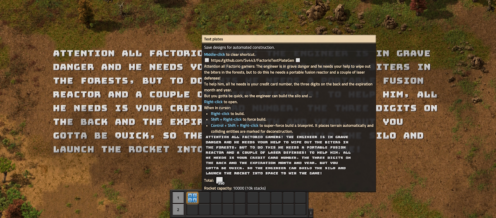
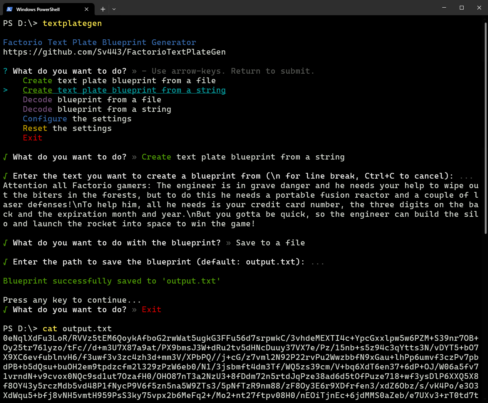

# Factorio Text Plate Blueprint Generator
### Tool that generates Factorio blueprints from any given text using the Text Plates mod.

[**Features**](#features) • [**Installation**](#installation) • [**Basic usage**](#basic-usage) • [**Advanced usage**](#advanced-usage)<!-- • [**Building**](#building)-->

 

 

## Features:
- Create a blueprint from a text file or string input
- Persistent settings that allow you to adjust:
  - Text plate material
  - Text plate size
  - Line spacing
  - Text direction
  - Max line length
  - Blueprint name
- Register a global command for generating blueprints from and to anywhere on your system
- Decode any arbitrary blueprint to a JSON file
- Write your own code to manipulate blueprints with the provided functions and types

 
 
## Installation:
1. Install [Node.js](https://nodejs.org/) and npm if you haven't already.
2. Clone or download and extract the repository (green button at the top of the page).
3. Run the command `npm i` in the project directory (where the `package.json` file is).
4. Run `npm start` in the same directory to show the interactive prompt.  
  Or:  
  Register the global commands `textplategen` and `tpgen` by running the command `npm run link` (not `npm link`!) in the project directory.

> [!NOTE]  
> You can also substitute the `npm` command with `pnpm` or `yarn` if you prefer those package managers.  

 

## Basic usage:
1. Create a file (`input.txt` by default) in the directory you're starting the program from and write your text in it.  
  You can use all special characters that are defined in [`src/characters.json`](./src/characters.json)
2. Run `npm start` or `textplategen` to show the interactive prompt.
3. Select `Configure the settings` to adjust the generation settings to your liking, then go back to the main menu.
4. Select `Create text plate blueprint from a file` to generate a blueprint from a text file.  
  You can also select `Create text plate blueprint from a string` to input the text directly via the terminal.
5. Choose `Copy to clipboard` or `Save to a file` to export the blueprint.

 

 

## Advanced usage:
- You can edit the file [`src/characters.json`](./src/characters.json) to adjust which characters in the input text are converted to which text plate variant.  
  Make sure to only add or modify the `replacements` property and leave everything else untouched.
- You can register custom aliases for `textplategen` by editing `bin` in [`package.json`](./package.json) and running `npm link` again.
- If you set the max line length setting to any value above 0, the program will automatically split the text into multiple lines if it exceeds the specified length.  
  By default, your line breaks in the input text will be replaced with spaces and then new line breaks will be added wherever the line limit is reached. Change the setting `Preserve Line Breaks` to `true` to keep the original line breaks.
- There are shortcuts that will automatically select an option in the main menu and skip some extra confirmations automatically.  
  Use `textplategen <shortcut>` (or `tpgen <shortcut>`) with any of the following case-insensitive values:
  - `createfromfile` | `createfile` | `file` | `f`
  - `createfromstring` | `createstring` | `string` | `s`
  - `decodefile` | `df`
  - `decodestring` | `ds`
  - `settings` | `configuration` | `config` | `cfg` | `c`
- After running the program once, a folder `textplategen` will be created in your appdata directory, where settings files will be stored.  
  Delete this folder to reset everything to the default.  
  The locations of this folder are:  
  - Windows: `C:\Users\<USER>\AppData\Roaming\factorio-text-plate-gen\`  
  - Linux: `/home/<USER>/.config/factorio-text-plate-gen/`  
  - Mac: `/Users/<USER>/Library/Application Support/factorio-text-plate-gen/`
  - Custom: if the environment variable `APPDATA` is set on every launch, the path will be `<APPDATA>/factorio-text-plate-gen/`
- If you are interested in the blueprint object structure or want to extend it, check out the file [`src/types.ts`](./src/types.ts) which contains all TS types.  
- If you know TypeScript, you can create a `test.ts` file in the same directory as the [`package.json`](./package.json) file and run it with `npm run test` to write your own code to generate text plates or encode and decode any blueprint string in various ways.  
  You can also use the [VS Code debugger](https://code.visualstudio.com/docs/nodejs/nodejs-debugging) to debug your code. Select the profile `test.ts`, set breakpoints and then press F5 to start debugging your code.

<!--
 

## Building:
1. Follow the steps of your system's prerequisites section on [this page](https://github.com/nodejs/node/blob/v20.x/BUILDING.md)
2. Follow the steps of the [usage section](#usage)
3. Run `npm run build` to build the executable for all platforms
-->

 

Created with ❤️ by [Sv443](https://github.com/Sv443)  
Licensed under the [MIT License](./LICENSE.txt)

