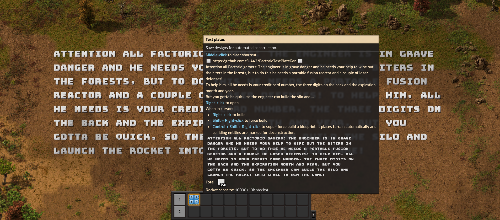

# Factorio Text Plate Blueprint Generator
### Interactive prompt to generate text plate blueprints for Factorio.

[**Features**](#features) • [**Installation**](#installation) • [**Basic usage**](#basic-usage) • [**Advanced usage**](#advanced-usage) • [**Building**](#building)

 

 

## Features:
- Create blueprint from file or text input
- Decode any blueprint to a JSON file from a file or text input
- Persistent settings that allow you to specify:
  - Text plate material
  - Text plate size
  - Line spacing
  - Text direction
  - Max line length
  - Blueprint name
- Global command for generating blueprints from and to anywhere on your system

 

## Installation:
1. Install Node.js and npm
2. Clone or download and extract the repository (green button at the top of the page)
3. Run the command `npm i` in the project directory (where the `package.json` file is)
4. Run `npm start` in the same directory to show the interactive prompt  
  or  
  Register the global command `factorio-text-plate-gen` by running the command `npm run link` (not `npm link`!) in the project directory

> [!NOTE]  
> - You can also substitute the `npm` command with `pnpm` or `yarn` if you prefer those package managers.  

 

## Basic usage:
1. Create a file (`input.txt` by default) in the directory you're starting the program from and write your text in it.  
  You can use all special characters that are defined in [`src/characters.json`](./src/characters.json)
2. Run `npm start` to show the interactive prompt and select `Configure the settings` to adjust the text plate settings.
3. Go back to the main menu and select `Create text plate blueprint from a file`.
4. Press enter to use the default file `input.txt` or enter the path to your file.
5. The blueprint will be saved to a file called `output.txt` in the directory you called the program.

 

 

## Advanced usage:
- You can edit the file [`src/characters.json`](./src/characters.json) to adjust which characters in the input text are converted to which text plate variant.  
  Make sure to only add or modify the `replacements` property and leave everything else untouched.
- You can register custom aliases for `factorio-text-plate-gen` by editing `bin` in [`package.json`](./package.json) and running `npm link` again.
- If you set the max line length setting to any value above 0, the program will automatically split the text into multiple lines if it exceeds the specified length.  
  Note that this will mean line breaks in the input text will be replaced with spaces and then new line breaks will be added wherever the line limit is reached.
- After running the program once, a folder `factorio-text-plate-gen` will be created in your appdata directory, where settings files will be stored.  
  You can delete this folder to reset everything to the default.
- If you are interested in the blueprint object structure or want to extend it, check out the file [`src/types.ts`](./src/types.ts) which contains all TS types.  
- If you know TypeScript, you can create a `test.ts` file in the same directory as the [`package.json`](./package.json) file and run it with `npm run test` to write your own code to generate text plates or encode and decode any blueprint string in various ways.  
  You can also use the [VS Code debugger](https://code.visualstudio.com/docs/nodejs/nodejs-debugging) to debug your code. Select the profile `test.ts`, set breakpoints and then press F5 to start debugging your code.

 

## Building:
1. Follow the steps of your system's prerequisites section on [this page](https://github.com/nodejs/node/blob/v20.x/BUILDING.md)
2. Follow the steps of the [usage section](#usage)
3. Run `npm run build` to build the executable for all platforms

 

Created with ❤️ by [Sv443](https://github.com/Sv443)  
Licensed under the [MIT License](./LICENSE.txt)

